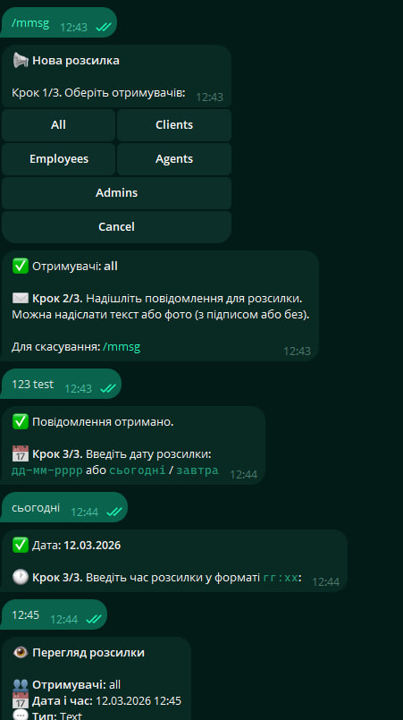
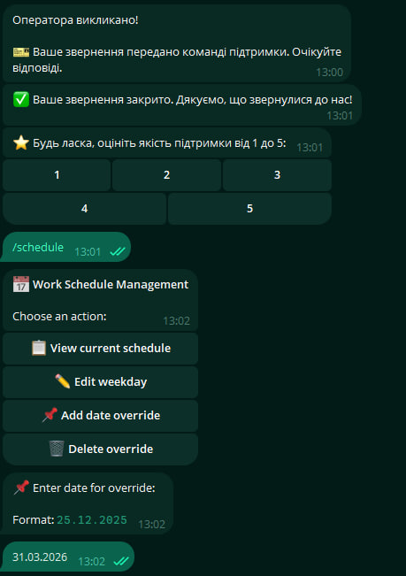
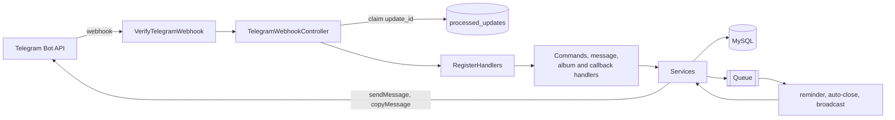

# Laravel Telegram Helpdesk

A support desk that lives entirely inside Telegram. Clients write to a bot in a private chat. Every client
gets a permanent **forum topic** in the agents' supergroup, and agents answer by replying in that topic.
The group *is* the ticket queue, so there is no separate web UI to build, host or teach anyone to use.

[](https://www.php.net/)
[](https://laravel.com/)
[](https://nutgram.dev/)
[](LICENSE)


---

## What it does

* Relays text, media and albums both ways. Albums are buffered and re-sent as a single group rather than
  leaking through as separate photos.
* Tracks ticket state (`open` / `pending` / `closed`), first-reply time and resolution time.
* Reminds agents about a waiting client, then auto-closes the ticket after a period of client silence.
* Answers outside working hours from a schedule with per-day times and date overrides, then sends agents a
  digest of everything that arrived overnight.
* Collects a 1 to 5 star rating with an optional comment after every closed ticket.
* Sends scheduled broadcasts to a chosen audience behind a preview-and-confirm flow.
* Keeps every user-facing string in the database. Ukrainian, English and Russian ship seeded; adding a
  language is a row, not a release.
* Exposes tickets and statistics over a Sanctum-protected JSON API, so a dashboard can be bolted on later
  without touching the bot.

<table>
<tr>
<td width="50%"></td>
<td width="50%"></td>
</tr>
<tr>
<td><code>/mmsg</code> — audience, message, date, then preview and confirm.</td>
<td><code>/schedule</code> — per-day hours and date overrides. Below it, the rating asked after a close.</td>
</tr>
</table>

---

## Architecture



Middleware verifies the shared secret. The controller claims the `update_id` before anything else. Nutgram
then routes the update to exactly one handler. Handlers stay thin: they parse intent and delegate. Services
own the domain logic and every outbound Telegram call, which keeps the Telegram API surface in one layer
instead of scattered across the codebase.

---

## Engineering notes

The parts of this project that were actually difficult, and what the reasoning was.

**Duplicate updates are prevented by the database, not by application logic.**
Telegram retries a webhook whenever it does not get a fast `200`, and retries can overlap. A
`select` followed by an `insert` loses that race under concurrency. Instead, `update_id` is claimed through
a unique index: the second concurrent attempt fails at the constraint and is dropped. The database is the
only component that can arbitrate this correctly, so it does.

**Handlers are registered per request, and their order matters.**
A webhook is stateless, so every call boots a fresh Nutgram instance and `run()` resolves the update
against a freshly built handler table. Album handlers register first on purpose: they swallow messages
carrying a `media_group_id`, which would otherwise be relayed once per photo and spam the agent topic with
five near-identical messages.

**Albums are buffered.**
Telegram delivers an album as N separate updates with a shared `media_group_id` and no "this is the last
one" signal. The bot collects them and re-sends the group as a unit, so the agent sees what the client
sent, not a burst of fragments.

**Localization lives in the database.**
Every user-facing string sits in `bot_resources`. Support content changes far more often than code does,
and shipping a release to fix a typo in a FAQ answer is the wrong trade. Adding a fourth language is
inserting rows.

**Conversation content never touches the application log.**
Message bodies are written only to `bot_logs`, a prunable audit trail with a retention policy. Application
logs go to aggregators, get read during debugging and are rarely treated as sensitive, so support
conversations do not belong there. API errors are logged in full but returned generically, so no exception
text ever reaches a client.

**Tests run on in-memory SQLite.**
No external services, no fixtures to provision, nothing to remember before running `composer test`.

---

## HTTP API

Ticket endpoints take a Sanctum bearer token. The webhook authenticates with the Telegram secret header
instead.

| Method | Endpoint | Description |
|---|---|---|
| `GET` | `/api/tickets` | Paginated list; filters `status`, `user_id`, `from`, `to`. |
| `GET` | `/api/tickets/{id}` | One ticket plus its event history. |
| `POST` | `/api/tickets/{id}/messages` | Sends an agent reply to the client. |
| `PUT` | `/api/tickets/{id}/close` | Closes a ticket and notifies the client. |
| `GET` | `/api/statistics` | Volume and response-time aggregates. |
| `POST` | `/api/telegram/webhook` | Telegram updates. |
| `GET` | `/up` | Health check. |

Issuing a token:

```bash
php artisan tinker
>>> App\Models\User::factory()->create()->createToken('dashboard')->plainTextToken
```

---

## Bot commands

| Command | Who | What it does |
|---|---|---|
| `/start` | everyone | Registers the user, sends the localized welcome. |
| `/new_ticket` | client | Opens a ticket explicitly. |
| `/close_ticket` | client | Closes the active ticket and asks for a rating. |
| `/my_tickets` | client | Lists recent tickets and their statuses. |
| `/faq` | client | Paginated FAQ built from database resources. |
| `/schedule` | admin | Editor for working hours and date overrides. |
| `/mmsg` | admin | Creates a scheduled broadcast. |
| `/listmsg` | admin | Lists and deletes pending broadcasts. |

Roles are `client`, `employee`, `agent`, `admin`, enforced by
[`AgentGuard`](app/Services/AgentGuard.php).

---

<details>
<summary><b>Running it locally</b></summary>

Needs Docker, Composer and a token from [@BotFather](https://t.me/BotFather).

```bash
cp .env.example .env
composer install
./vendor/bin/sail up -d
./vendor/bin/sail artisan key:generate
./vendor/bin/sail artisan migrate --seed
```

Then connect Telegram:

1. Create a supergroup for the agents and turn on **Topics**.
2. Add the bot, promote it to admin, and grant *Manage Topics* and *Pin Messages*.
3. Put the group's numeric ID in `TELEGRAM_SERVICE_CHAT_ID`.
4. Generate a secret, expose the app over HTTPS, register the webhook:

   ```bash
   php -r "echo bin2hex(random_bytes(32));"   # TELEGRAM_WEBHOOK_SECRET
   ./vendor/bin/sail artisan telegram:set-webhook
   ```

5. Run the worker and the scheduler (Supervisor or systemd in production):

   ```bash
   ./vendor/bin/sail artisan queue:work
   ./vendor/bin/sail artisan schedule:work
   ```

Message the bot. A topic named `#<telegram_id> @username Full Name` appears in the group; reply there and
the client gets the answer.

Tests and static checks:

```bash
composer test
composer lint
```

</details>

<details>
<summary><b>Configuration</b></summary>

| Variable | Default | Purpose |
|---|---|---|
| `TELEGRAM_BOT_TOKEN` | | Token from @BotFather. |
| `TELEGRAM_SERVICE_CHAT_ID` | | Numeric ID of the agents' forum supergroup. |
| `TELEGRAM_WEBHOOK_URL` | | Public HTTPS URL passed to `setWebhook`. |
| `TELEGRAM_WEBHOOK_SECRET` | | Shared secret. Updates without a matching header are rejected. |
| `BOT_REMINDER_TIMEOUT` | `60` | Minutes before agents are reminded about a waiting client. |
| `BOT_AUTO_CLOSE_TIMEOUT` | `15` | Minutes of client silence before a ticket auto-closes. |
| `BOT_AGENT_WHITELIST_ENABLED` | `false` | Restrict agent actions to an explicit ID list. |
| `BOT_AGENT_WHITELIST` | | Comma-separated Telegram IDs allowed to act as agents. |
| `BOT_AUTO_PROMOTE_AGENTS` | `true` | Promote service-chat members to `agent` on first reply. |
| `BOT_EMPLOYEE_LIST` | | Telegram IDs treated as internal staff. They must pick a project. |
| `FORWARDED_TO_CLIENT_REACTION` | | Emoji the bot reacts with once a reply reaches the client. |
| `APP_TIMEZONE` | `UTC` | Timezone used for all work-schedule maths. |

Timers, rating rules, topic colours and logging switches live in [`config/bot.php`](config/bot.php).

</details>

---

## Stack

PHP 8.2 · Laravel 12 · Nutgram 4 · MySQL 8 · Laravel queues · Sanctum · Docker (Sail) · PHPUnit 11

## License

MIT, see [LICENSE](LICENSE).

---

Built by Oleksii Ilienko.
[GitHub](https://github.com/CaptainAlexxxx) · [Telegram](https://t.me/CaptainAlexxx) · alexthearts@gmail.com
